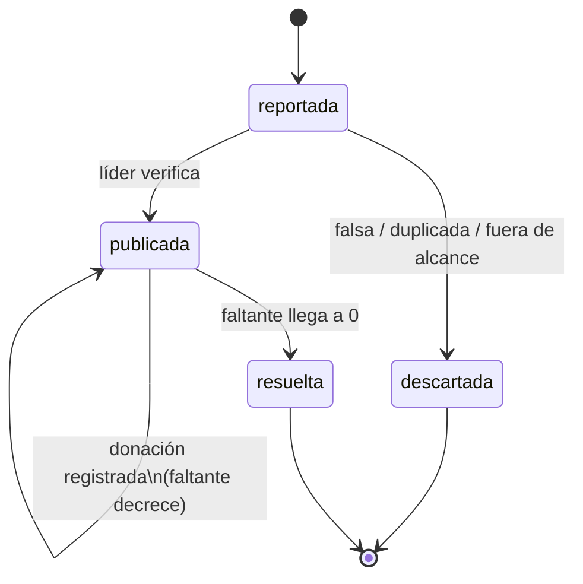
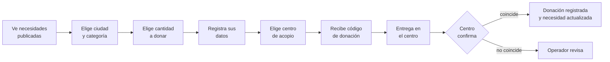
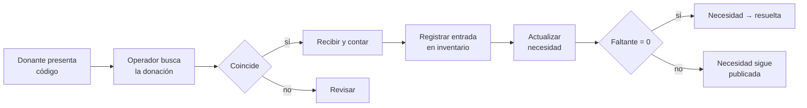
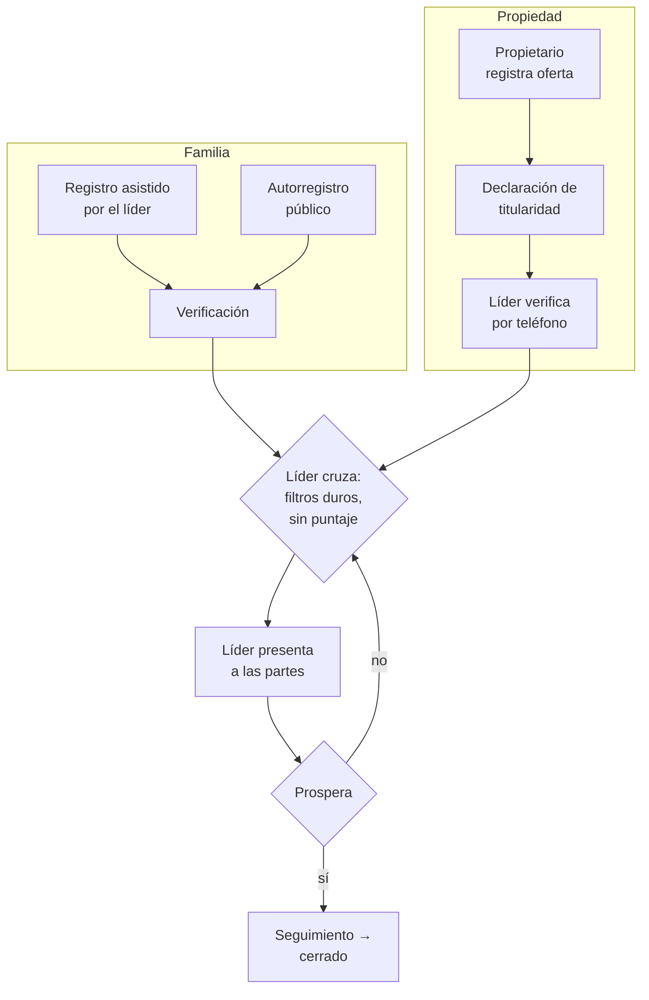
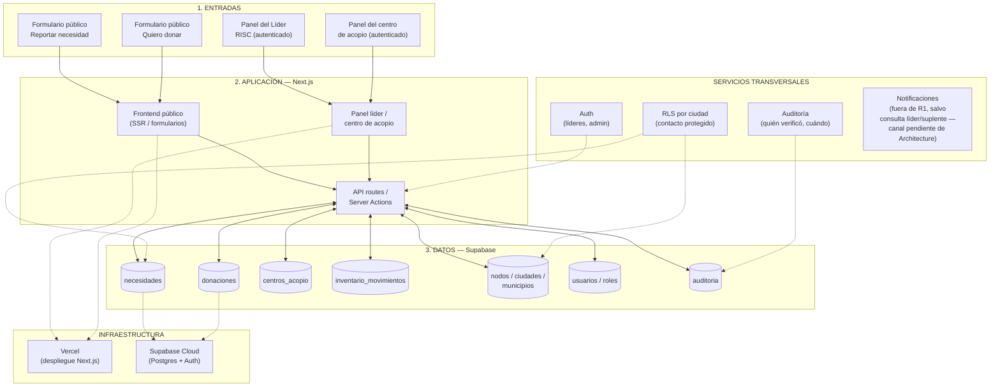

# RISC Platform

**Red Inmobiliaria Solidaria Colombia** — plataforma de coordinación de
emergencia humanitaria y habitacional para el sector inmobiliario
colombiano, tras el sismo del 10 de agosto de 2026.

RISC conecta necesidades verificadas con quienes pueden resolverlas
—donantes, centros de acopio, propietarios— sin depender de la memoria
de un líder ni de un hilo de WhatsApp. Nada llega al público sin pasar
antes por verificación humana.

## Estado del proyecto

Metodología **VerticalOS**, Tier 3. Pipeline en curso:

```
Business Discovery   ✅ docs/vertical-os/01-Business-Discovery.md
OpenSpec              ✅ docs/vertical-os/02-OpenSpec.md
PRD                    ✅ docs/vertical-os/03-PRD.md
Epic Planning          ✅ docs/vertical-os/epics/ (9 epics, E1–E9)
User Stories           ✅ R1 (E1,E2,E3,E8,E9) — 24 historias
Technical Tasks        ✅ R1 — sin stack, checklist en cada US
                          Sin puntos abiertos conocidos en R1.
Arquitectura            ⬅ siguiente paso (elegir stack, ADR-0001)
```

Contexto de negocio, decisiones cerradas y roadmap completo:
`~/Desktop/risc-vault` (Obsidian).

---

## Flujos

### Ciclo de vida de una necesidad (R1)

Cuatro estados. Sin campo de prioridad — la cola se ordena sola por
fecha límite y cuánto falta, no por un nivel de urgencia que todos
marcarían igual.



### Flujo del donante



### Recepción en el centro de acopio



### Vivienda y reubicación — R1.5 → R2

No entra en R1. El registro empieza en R1.5 con cruce manual; el motor
de cruce llega en R2. Sin puntaje de compatibilidad — filtros duros
(ciudad, capacidad, mascotas, presupuesto) y el líder decide.



---

## Arquitectura (aprobada — ADR-0001)

> Decisión cerrada del pipeline VerticalOS, no una hipótesis de
> trabajo. Razonamiento completo, alternativas descartadas y cuándo
> reconsiderar cada elección: `docs/adr/0001-stack-selection.md`.

Stack: **Next.js + Supabase, sin ORM aparte**. El riesgo central del
dominio —proteger el contacto de familias y propietarios
damnificados— se resuelve con RLS en Postgres, no con lógica de
aplicación: un endpoint mal escrito no puede exponer una fila que la
base nunca le devuelve. Sin ORM porque la mayoría se conecta con una
credencial de servicio que evita RLS por completo — ver el ADR para el
detalle.



### Entidades principales de datos (alcance R1)

| Tabla | Contiene |
|---|---|
| `necesidades` | La regla de oro: responsable, ubicación, cantidad, fecha límite, estado |
| `donaciones` | Compromiso del donante, código, estado de entrega |
| `centros_acopio` | Ubicación, responsable, horario por ciudad |
| `inventario_movimientos` | Entradas y salidas del centro |
| `nodos` / `ciudades` / `municipios` | Cali, Manizales, Armenia, Pereira + municipios de Tolima y Chocó (pendiente) |
| `usuarios` | Líderes RISC y admin, con rol y ciudad asignada |
| `auditoria` | Quién verificó, cuándo, qué cambió |

Vivienda (`familias`, `propiedades`) entra en R1.5/R2 — ver
`~/Desktop/risc-vault/02 - Alcance y Epics.md`.

### Decisiones de seguridad que ya están cerradas

- El contacto de una familia o propietario solo lo ve el líder de esa
  ciudad — RLS en Postgres, no lógica de aplicación.
- Nada se publica sin verificación humana.
- RISC no recibe, custodia ni intermedia dinero.
- Sin carga de documentos de titularidad — el líder verifica por
  teléfono, no se almacenan escrituras de terceros.

---

## Pipeline VerticalOS

- `docs/vertical-os/01-Business-Discovery.md`
- Contexto completo, decisiones y roadmap: `~/Desktop/risc-vault`
